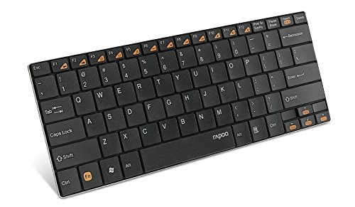

# VIMSticker

VIMSticker, as you can guess by the name, are stickers with vi/vim-commands. I designed them with my own Rapoo E9050 Blade Series Wireless Kompakt Ultra-slim keyboard in mind.

I first created the stickers in Microsoft Visio 2013 but the exported SVG files imported badly in the Silhouette Studio which i use to cut them. So i redesigned all sticker in inkscape which is known creating correct SVG files.

## Size
* Regular
  * 15 x 15 mm
* First row & direction keys
  * 7.5 x 15 mm

## Colors

* Motion
  * Background (88, 128, 179)
  * Font (255, 255, 255)
* Command
  * Background (146, 205, 220)
  * Font (0, 0, 0)
* Operator
  * Background (192, 0, 0)
  * Font (255, 255, 255)
* Extra
  * Background (127, 127, 127)
  * Font (255, 255, 255)
* Key
  * Background (0, 0, 0)
  * Font (0, 0, 0)